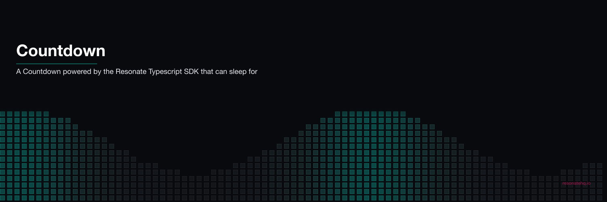
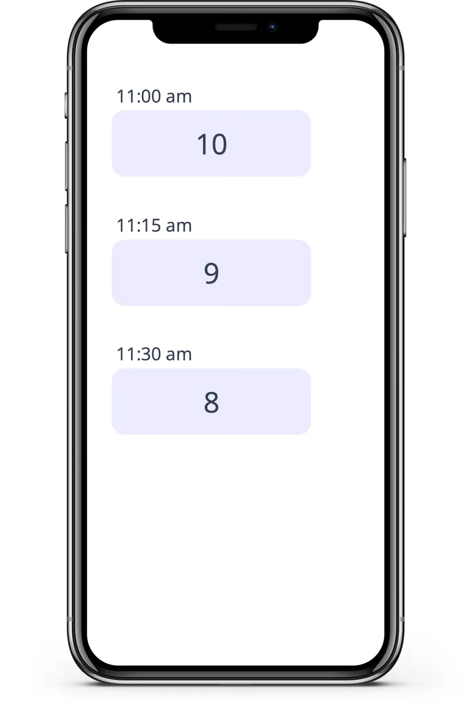

<p align="center">
  
</p>

# Resonate Countdown

A *Countdown* powered by the Resonate TypeScript SDK. The countdown sends notifications to [ntfy.sh](https://ntfy.sh/), a simple HTTP-based notification service, at configurable intervals.



## Behind the Scenes

The Countdown is implemented with Resonate's Durable Execution framework, Distributed Async Await. The Countdown is a simple loop that can sleep for hours, days, or weeks. On `yield ctx.sleep` the countdown function suspends, and after the specified delay, Resonate will resume the countdown function.

```typescript
export function* countdown(
	ctx: Context,
	count: number,
	delay: number,
	url: string,
) {
	for (let i = count; i > 0; i--) {
		// send notification to ntfy.sh
		yield* ctx.run(notify, url, `Countdown: ${i}`);
		// sleep creates a suspension point
		yield* ctx.sleep(delay * 60 * 1000);
	}
	// send the last notification to ntfy.sh
	yield* ctx.run(notify, url, `Done`);
}
```

Try yourself: Between notifications, kill the worker and restart. The countdown won't be affected and picks up exactly where it left off.


## Setup Dependencies:

### 1 Setup the Resonate Server

Install the [Resonate Server](https://github.com/resonatehq/resonate)

```
brew install resonatehq/tap/resonate
```

### 2 Setup the countdown

Clone the repository

```bash
git clone https://github.com/resonatehq-examples/example-countdown-ts.git
```

Install dependencies

```bash
npm install
```

## Running the Project

### 1. Start the Resonate Server

In Terminal #1, start the Resonate server in development mode listening on `http://localhost:8001`.

```bash
resonate dev
```

- When you start the server in development mode, the server does not persist data on disk and will lose its state when you stop the process

### 2. Start the Worker

In Terminal #2, start the Resonate worker:

```bash
npm start
```

### 3. Invoke a Countdown

In Terminal #3, start the countdown, for example, counting down from 5, every minute, and posting notifications to https://ntfy.sh/resonatehq:

```bash
resonate invoke countdown.1 --func countdown --arg 5 --arg 1 --arg https://ntfy.sh/resonatehq
```

**Parameters:**

- `countdown.1`: Unique ID for this countdown
- `--arg 5`: Count down from 5
- `--arg 1`: Wait 1 minute between counts
- `--arg https://ntfy.sh/resonatehq`: Where to send notifications

Open `https://ntfy.sh/resonatehq` in your browser to see the notifications in real-time.

## Checking Progress

Get details of a specific countdown:

```bash
resonate promises get countdown.1
```

View all promises:

```bash
resonate promises search --tags '{"resonate:origin":"countdown.1"}'
```

## Learn More

- [Resonate Documentation](https://docs.resonatehq.io)
- [Durable Sleep Explained](https://docs.resonatehq.io/concepts/sleep)
- [TypeScript SDK Guide](https://docs.resonatehq.io/develop/typescript)
